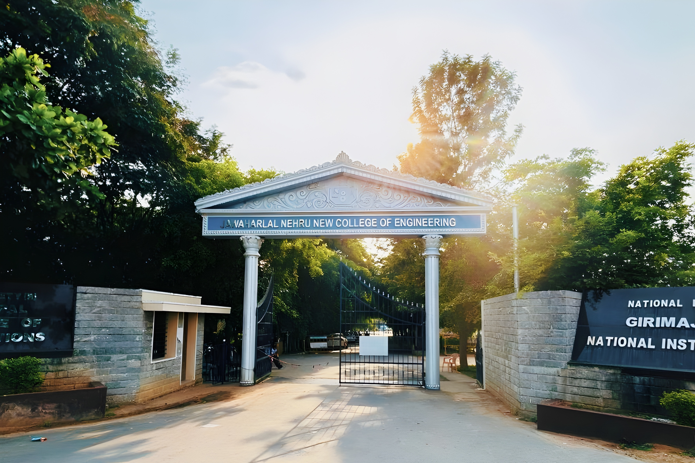

# JNNCE MCA Department Web Portal



Official modernized web portal for the **Master of Computer Applications (MCA)** department at Jawaharlal Nehru National College of Engineering (JNNCE), Shivamogga. 

This project aims to provide a premium, mobile-first, and highly performant digital experience for students, faculty, and prospective candidates.

---

## ✨ Key Features

- **Mobile-First Responsive Design**: Flawless layout adapting seamlessly from 4K desktop screens down to 320px mobile viewports.
- **Modern UI/UX Aesthetics**: Implementation of glassmorphism, dynamic shadow elevations, and scroll-reveal intersection observer animations.
- **Performant Architecture**: Zero heavy frontend frameworks. Built completely in Vanilla HTML5, CSS3, and JavaScript ensuring blazing-fast load times.
- **Optimized Media Loading**: Implemented lazy loading and asynchronous decoding (`loading="lazy"`, `decoding="async"`) across all images and embedded PDF documents to reduce Layout Shift (CLS) and initial payload.
- **Accessible Navigation**: Premium animated sliding mobile drawer with touch-friendly spacing, dark overlay, and Escape key listeners for enhanced accessibility.

## 🛠️ Technology Stack

- **Structure**: Semantic HTML5
- **Styling**: Vanilla CSS3 (Custom design system variables, CSS Grid, Flexbox, `clamp()` fluid typography)
- **Interactivity**: Vanilla JavaScript (ES6+ features, Intersection Observers, DOM manipulation)
- **Icons**: FontAwesome 6

## 📂 Project Structure

```text
├── css/
│   └── style.css          # Main stylesheet with layout and component rules
├── js/
│   ├── script.js          # Core legacy routing and base logic
│   └── premium-ui.js      # Advanced scroll animations and mobile navigation
├── img/                   # Core asset directory (Optimized WebP/JPG/PNG)
├── pdf/                   # Embedded PDFs (Resumes, Syllabi, Reports)
├── index.html             # Landing Page
├── departments.html       # About Us & Department Details
├── faculty-mca.html       # Faculty Directory
├── facilities.html        # Overview of Campus Facilities
├── facilities-detail.html # Detailed breakdown of infrastructure
└── contact.html           # Maps & Quick Links
```

## 🚀 Setup & Installation

Since this project has zero dependencies or build-steps, you don't need Node.js or any build tools to run it.

1. **Clone the repository:**
   ```bash
   git clone https://github.com/kiranss7/JNNCE_MCA_Website.git
   ```

2. **Run Locally:**
   - Simply open `index.html` in your favorite modern browser.
   - *Alternatively, for a better development experience, use the VS Code **Live Server** extension.*

---
**Maintained by:** Kiran S S (@kiranss7)
